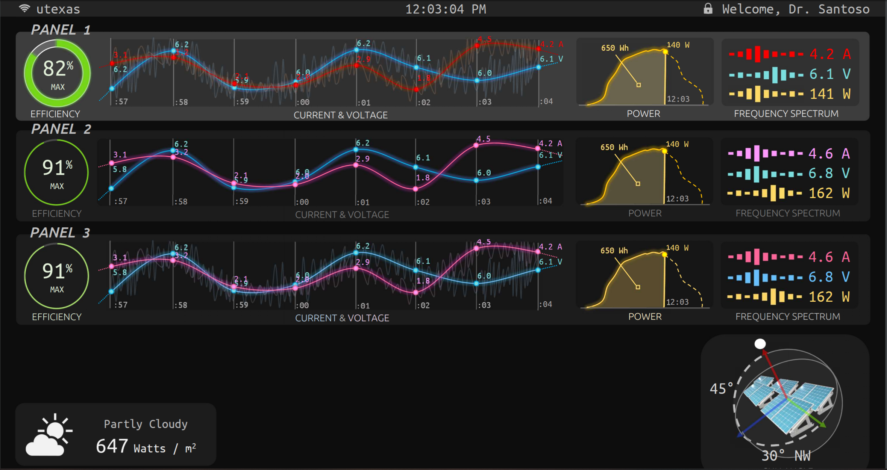

# Solar Monitoring Project Dashboard

Visit the [Storybook](https://santoso-solar-monitoring-project.github.io/main-page/) to see the components being built.

Visit the [Projects tab](https://github.com/santoso-solar-monitoring-project/main-page/projects?query=is%3Aopen+sort%3Aupdated-desc) on GitHub to see a breakdown of work.

Mockup:



File Overview:

[//]: # (Don't edit manually past this point. It will be overwritten in the pre-commit git hook.)

```bash
$ wc -l src/components/*/** src/utils/**/* src/utils/*
     75 src/components/Blur/index.tsx
     47 src/components/CornersTest/Corners.tsx
     14 src/components/CornersTest/index.tsx
     29 src/components/Glow/index.tsx
      8 src/components/GoodCanvas/GoodCanvasChild.ts
     15 src/components/GoodCanvas/GoodCanvasElement.ts
    195 src/components/GoodCanvas/index.tsx
    205 src/components/IVPlot/_IVPlot.tsx
     79 src/components/IVPlot/index.tsx
     93 src/components/IVPlot/Ticks.tsx
     20 src/components/IVPlot/useAnimationClock.ts
     60 src/components/IVPlot/useAnimationFrame.ts
     25 src/components/IVPlot/useClip.ts
    154 src/components/IVPlot/useControls.ts
     23 src/components/IVPlot/useDash.ts
     54 src/components/IVPlot/useDataFeed.ts
     69 src/components/IVPlot/useFPS.ts
     35 src/components/IVPlot/useLine.ts
     14 src/components/IVPlot/usePaddingSpring.ts
     24 src/components/IVPlot/useTimespan.ts
     88 src/components/IVPlot/useView.ts
     44 src/components/TitleBar/index.js
      4 src/components/TitleBar/lock.svg
     21 src/components/TitleBar/Login.js
     14 src/components/TitleBar/Time.js
     35 src/components/TitleBar/Wifi.js
     34 src/components/useLine/index.tsx
     37 src/components/usePoints/index.tsx
      1 src/components/Weather/index.tsx
      6 src/utils/canvas/clear.ts
    204 src/utils/canvas/enhanceContext.ts
     38 src/utils/canvas/EnhancedContext.ts
     35 src/utils/canvas/getContext.ts
     18 src/utils/canvas/index.ts
     21 src/utils/canvas/isValidGoodCanvas.ts
     84 src/utils/canvas/newEffect.ts
     53 src/utils/canvas/scaleCanvas.ts
     10 src/utils/CustomHooks/index.ts
      7 src/utils/CustomHooks/useCounter.ts
     31 src/utils/CustomHooks/useDataBuffer.ts
     28 src/utils/CustomHooks/useDataBufferSilent.ts
     35 src/utils/CustomHooks/useDecay.ts
     19 src/utils/CustomHooks/useFIR.ts
      8 src/utils/CustomHooks/useMemoRef.ts
     32 src/utils/CustomHooks/useMemoSpring.ts
      7 src/utils/CustomHooks/useSilentCounter.ts
     10 src/utils/CustomHooks/useSilentSwitch.ts
     43 src/utils/CustomHooks/useThrottled.ts
     23 src/utils/Imm/index.ts
     49 src/utils/Imm/makeImmHook.ts
      8 src/utils/Imm/mapFromJS.ts
     18 src/utils/Imm/useImm.ts
    135 src/utils/Imm/withImm.ts
     16 src/utils/BaseProps.ts
wc: src/utils/canvas: Is a directory
      0 src/utils/canvas
      8 src/utils/clamp.ts
     25 src/utils/coordinates.ts
wc: src/utils/CustomHooks: Is a directory
      0 src/utils/CustomHooks
    235 src/utils/DefaultProps.ts
      5 src/utils/diff.ts
      7 src/utils/easier.ts
      4 src/utils/evaluate.ts
      2 src/utils/identity.ts
      2 src/utils/ignore.ts
wc: src/utils/Imm: Is a directory
      0 src/utils/Imm
     19 src/utils/isValidRefObject.ts
    136 src/utils/meta.ts
      2 src/utils/noop.ts
      1 src/utils/Pair.d.ts
     29 src/utils/propagateProps.tsx
     48 src/utils/throttleEvent.ts
      3 src/utils/warn.ts
   2980 total
```
